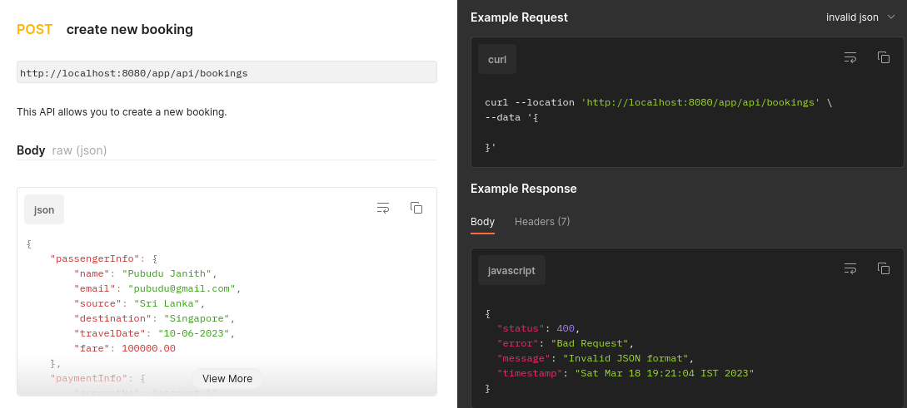
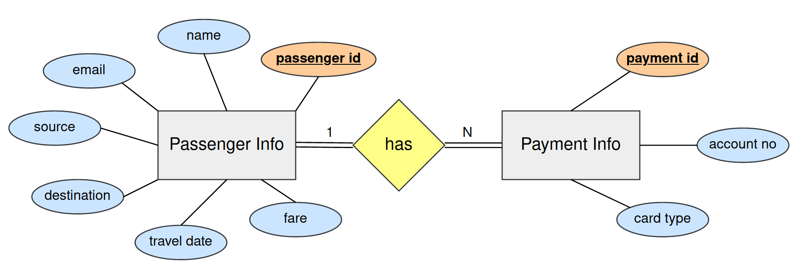

# Booking Application - Back End 

This project was developed using the **Spring Boot framework** with having **n-tier architecture** to understand and improve the 
knowledge of **database transaction handling** with Spring Boot.
In this project, **booking web service** is exposed as an **API** under the **bookings** resource and more information on the booking web 
service with example test cases can be found in the below API documentation.

- [**Bookings API documentation**](https://documenter.getpostman.com/view/25306703/2s93JzLfmy)

#### Highlighted features of the application,

- In this project, **four accounts** with the names **account 1, account 2, account 3, and account 4** are formed.

- The respective balances of these accounts are **1,200,000 LKR, 1,000,000 LKR, 800,000 LKR, and 600,000 LKR.**

- If the **booking fare** is less than the balance of the account that was sent through the Payment details, a booking has been made.
Here, there will be **two write operations** performed on the **Passenger Info** and **Payment Info** database tables.

- Booking will not be performed and the transaction will be **rolled back** if the **booking fare** is higher than the **balance of the supplied account**.
There won't be any **write operations** performed on the **Payment Info** or **Passenger Info** database tables.

#### Few snapshots of the documentation

- Transaction got rolled back. 

[//]: # ()

- Transaction got committed. 

[//]: # ()

- Send incorrect JSON in request payload.. 

[//]: # ()

#### ERD of the database

## Used Technologies

- Java SE 11
- Spring Boot 2.7.8
- Apache Maven 3.8.6
- MySQL Community Server 8.0.31
- Added dependencies to pom.xml
    - spring-boot-starter-web 2.7.8
    - spring-boot-starter-validation 2.7.8
    - spring-boot-starter-data-jpa 2.7.8
    - spring-boot-starter-aop 2.7.8
    - spring-boot-starter-test 2.7.8
    - spring-boot-devtools
    - lombok 1.18.24
    - mysql-connector-j 8.0.31

#### Used Integrated Development Environment
- IntelliJ IDEA

## How to use ?
This project can be used by cloning the 
project to your local computer.

Make sure to create a **booking_app_db** database in the MySQL community server.
If neglect to create, the project will automatically generate it when it is firstly executed.

#### Clone this repository
1. Clone the project using `https://github.com/PubuduJ/booking-application-back-end.git` terminal command.
2. Open the `pom.xml` file from **IntelliJ IDEA**, make sure to open this as a project.
3. Change the `spring.datasource.password` in the `application.properties` to your local machine MySQL server password.

## Version
v1.0.0

## License
Copyright &copy; 2023 [Pubudu Janith](https://www.linkedin.com/in/pubudujanith94/). All Rights Reserved. 
This project is licensed under the [MIT license](LICENSE.txt).